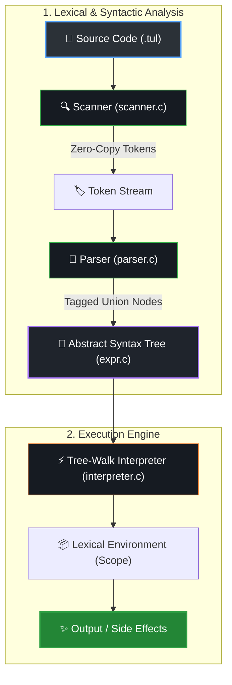

<div align="center">

  <h1>⚡ TUL-X</h1>
  <p><b>A High-Performance, Handcrafted Programming Language Interpreter in Pure C</b></p>
  <p><i>Crafted from first principles — inspired by Robert Nystrom's <b>Crafting Interpreters</b>.</i></p>

  <br/>

  [](https://en.wikipedia.org/wiki/C99)
  [](Makefile)
  [](#-memory-safety--systems-engineering)
  [](LICENSE)

  <br/>
  <br/>

  <a href="#-features--highlights">Features</a> •
  <a href="#-architecture--pipeline">Architecture</a> •
  <a href="#-quickstart--build-guide">Quickstart</a> •
  <a href="#-language-showcase">Language Showcase</a> •
  <a href="#-systems-engineering">Under the Hood</a> •
  <a href="#-roadmap">Roadmap</a>

</div>

---

## 🌟 Overview

**TUL-X** is an interpreted, dynamically-typed scripting language implemented entirely from scratch in pure C99 without external dependencies or third-party parser generators. 

It is engineered to demonstrate the full lifecycle of programming language implementation: from raw character stream processing and zero-copy tokenization to recursive descent parsing, Abstract Syntax Tree (AST) construction, and tree-walk runtime evaluation.

```tul
// Sample TUL-X Script (.tul)
fun fib(n) {
    if (n <= 1) return n;
    return fib(n - 1) + fib(n - 2);
}

var result = fib(10);
print "10th Fibonacci: " + result;
```

---

## 🚀 Features & Highlights

<table>
  <tr>
    <td width="50%" valign="top">
      <h3>🔍 Handcrafted Lexical Scanner</h3>
      <ul>
        <li>Single and multi-character token recognition (<code>==</code>, <code>!=</code>, <code>&lt;=</code>, <code>&gt;=</code>).</li>
        <li>Zero-copy lexeme referencing directly into source buffers.</li>
        <li>16 reserved keywords with Trie/table matching.</li>
        <li>Multi-line string and numeric literal parsing with line tracking.</li>
      </ul>
    </td>
    <td width="50%" valign="top">
      <h3>🌳 Recursive Descent Parser</h3>
      <ul>
        <li>Hand-written top-down parser implementing Context-Free Grammar (CFG).</li>
        <li>Mathematical operator precedence & associativity resolution.</li>
        <li>Panic-mode error recovery with automatic statement synchronization.</li>
        <li>S-Expression AST visualizer for tree inspection.</li>
      </ul>
    </td>
  </tr>
  <tr>
    <td width="50%" valign="top">
      <h3>🛡️ Memory Safety & Zero Leaks</h3>
      <ul>
        <li>Strict ownership semantics for all heap allocations.</li>
        <li>Continuous validation using <code>AddressSanitizer</code> (ASan) and <code>UBSan</code>.</li>
        <li>Recursive tree destructors (<code>freeExpr</code>, <code>freeScanner</code>).</li>
      </ul>
    </td>
    <td width="50%" valign="top">
      <h3>💻 Interactive REPL & CLI Runner</h3>
      <ul>
        <li>Interactive Read-Eval-Print Loop (<code>./tulx</code>).</li>
        <li>Standalone script runner (<code>./tulx script.tul</code>).</li>
        <li>Debugging flags (<code>--scan</code> for raw token stream dumping).</li>
        <li>Standard POSIX / sysexits error code compliance.</li>
      </ul>
    </td>
  </tr>
</table>

---

## 🏗️ Architecture & Pipeline



---

## 💻 Quickstart & Build Guide

### Prerequisites
- A C99-compliant compiler (`gcc` or `clang`)
- `make`
- macOS, Linux, or WSL (Windows Subsystem for Linux)

### Building the Binary

```bash
# 1. Clone the repository
git clone https://github.com/himanshu-shakya/Tul-X.git
cd Tul-X

# 2. Compile optimized production build
make

# 3. (Optional) Compile debug build with AddressSanitizer
make debug
```

---

### Running TUL-X

#### 1. Interactive REPL Mode
Launch the interactive shell to type and evaluate statements immediately:
```bash
./tulx
```
```text
==========================================
  TUL-X Interpreter (Crafting Interpreters)
  Type 'exit' or press Ctrl+D to quit.
==========================================
tul-x > 1 + 2 * 3
(+ 1 (* 2 3))

tul-x > (10 > 5) == !false
(== (group (> 10 5)) (! false))
```

#### 2. Execute a `.tul` Script File
```bash
./tulx examples/hello.tul
```

#### 3. Token Inspection Mode (`--scan`)
Inspect the raw token stream produced by the lexical analyzer:
```bash
./tulx --scan tests/scanner/test_literals.tul
```

#### 4. Run Automated Test Suite
```bash
make test
```

---

## 🛠️ Systems Engineering & C Implementation Details

### 1. Tagged Unions for Polymorphic AST Nodes
Without object-oriented class inheritance, TUL-X implements AST polymorphism in pure C using **Tagged Unions** (`enum ExprType` + `union`):

```c
typedef enum {
    EXPR_BINARY,
    EXPR_UNARY,
    EXPR_LITERAL,
    EXPR_GROUPING
} ExprType;

struct Expr {
    ExprType type;
    union {
        struct { Expr* left; Token operator; Expr* right; } binary;
        struct { Token operator; Expr* right; } unary;
        struct { Value value; } literal;
        struct { Expr* expression; } grouping;
    } as;
};
```
* **Memory Efficient**: The memory footprint of any `Expr` node is only as large as its largest variant + enum tag.
* **Double-Dispatch Visitor Pattern**: Implemented via function-pointer structs (`ExprVisitor`) for clean separation of concerns.

### 2. Zero-Copy String Slices
Tokens avoid costly `malloc` / `strdup` calls during scanning:
```c
typedef struct {
    TokenType type;
    const char* start; // Points directly into the original source buffer
    int length;        // Character count
    int line;
    void* literal;
} Token;
```

### 3. Dynamic Array Amortization
Token streams grow geometrically (`capacity = capacity * 2`), providing **$O(1)$ amortized insertion** time.

---

## 📋 Implementation Roadmap

- [x] **Phase 0 — Project Setup & Build Automation** *(Makefile, .gitignore, clean CLI baseline)*
- [x] **Phase 1 — Lexical Scanner** *(Single & multi-char tokens, literals, lookahead, error handling)*
- [x] **Phase 2 — Expressions & Grammar** *(Recursive descent parser for arithmetic, comparisons, logic)*
- [x] **Phase 3 — Abstract Syntax Tree (AST)** *(Tagged unions, AST node constructors, S-expression pretty printer)*
- [ ] **Phase 4 — Tree-Walk Interpreter** *(Runtime evaluation, dynamic typing, truthiness, unary/binary ops)*
- [ ] **Phase 5 — Statements & State** *(Expression statements, print statements, variable bindings)*
- [ ] **Phase 6 — Control Flow** *(Branching `if`/`else`, `while`, `for`, short-circuiting logicals)*
- [ ] **Phase 7 — Functions & Call Frames** *(Function declarations, calls, parameter binding, return values)*
- [ ] **Phase 8 — Lexical Scope & Environments** *(Environment chain, variable shadowing)*
- [ ] **Phase 9 — Closures** *(Heap-allocated upvalues, captured variable lifetimes)*
- [ ] **Phase 10 — Classes & Objects** *(Classes, instances, fields, methods, `this` binding)*
- [ ] **Phase 11 — Inheritance** *(Subclasses, method overriding, `super` dispatch)*
- [ ] **Phase 12 — Bytecode Virtual Machine** *(Chunk compiler, bytecode VM, stack-based evaluation)*

---

## 🧪 Testing Matrix

| Test Suite | Coverage | Status |
| :--- | :--- | :---: |
| **Scanner Tests** | All single & multi-char tokens, literals, comments, keywords | `PASSED` ✅ |
| **Expression Tests** | Arithmetic, comparisons, logicals, grouping, operator precedence | `PASSED` ✅ |
| **Error Handling** | Unterminated strings, unexpected characters, unmatched parentheses | `PASSED` ✅ |
| **Memory Sanitizer** | Valgrind / LLVM AddressSanitizer & UndefinedBehaviorSanitizer | `ZERO LEAKS` 🛡️ |

---

## 📄 License

This project is licensed under the **[MIT License](LICENSE)**.
