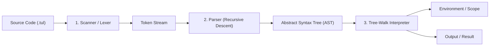

<div align="center">
  <h1>TUL-X</h1>
  <p>A lightweight interpreter-based programming language built in pure C.</p>
  <p><i>Crafted from first principles, inspired by Robert Nystrom's <b>Crafting Interpreters</b>.</i></p>

  <br/>

  
  
  
  
</div>

---

## 🌟 Overview

**TUL-X** is an educational interpreter designed to master compiler design, interpreters, runtime environments, memory management, and systems programming in C from first principles.

### Key Goals
- **From Source to Execution**: Understand lexical scanning, recursive descent parsing, Abstract Syntax Trees (AST), dynamic type evaluation, lexical scoping, closures, and object-oriented runtime structures.
- **Mastery in C**: Safe manual memory management (`malloc`, `free`, tagged unions, pointers, function pointers), zero memory leaks, and sanitization with `AddressSanitizer`.
- **Interview Readiness**: Curated notes, conceptual checkpoints, and architectural knowledge targeting technical software engineering interviews (e.g., Accenture, FAANG).

---

## 🏗️ Execution Pipeline



---

## 🚀 Getting Started

### Prerequisites
- A C99-compliant compiler (`gcc` or `clang`)
- `make`
- macOS / Linux / WSL

### Building the Project

```bash
# Standard optimized build
make

# Debug build with AddressSanitizer and symbols
make debug

# Clean build artifacts
make clean
```

### Running TUL-X

#### 1. Interactive REPL Mode
```bash
./tulx
```
```text
==========================================
  TUL-X Interpreter (Crafting Interpreters)
  Type 'exit' or press Ctrl+D to quit.
==========================================
tul-x > var message = "Hello, TUL-X!";
tul-x > print message;
```

#### 2. Execute a Script File
```bash
./tulx examples/hello.tul
```

#### 3. Run Automated Tests
```bash
make test
```

---

## 📋 Implementation Roadmap

- [x] **Phase 0 — Project Setup** *(Makefile, .gitignore, project structure, REPL baseline, docs)*
- [ ] **Phase 1 — Scanner / Lexer** *(Tokens, lexemes, operators, literals, lookahead)*
- [ ] **Phase 2 — Expressions & Grammar** *(Recursive descent parser for arithmetic, comparisons, logic)*
- [ ] **Phase 3 — Abstract Syntax Tree (AST)** *(Tagged unions, tree representations, AST printer)*
- [ ] **Phase 4 — Tree-Walk Interpreter** *(Runtime evaluation, dynamic typing, truthiness, unary/binary ops)*
- [ ] **Phase 5 — Statements & State** *(Expression statements, print statements, variable bindings)*
- [ ] **Phase 6 — Control Flow** *(Branching `if`/`else`, `while`, `for`, short-circuiting logicals)*
- [ ] **Phase 7 — Functions & Call Stack** *(Function declarations, calls, parameters, return values, call frames)*
- [ ] **Phase 8 — Scope & Environments** *(Lexical scoping, environment chains, shadowing)*
- [ ] **Phase 9 — Closures** *(Heap-allocated environments, upvalues, variable lifetimes)*
- [ ] **Phase 10 — Classes & Objects** *(Classes, instances, fields, methods, `this` binding)*
- [ ] **Phase 11 — Inheritance** *(Class inheritance, method overriding, `super` dispatch)*
- [ ] **Phase 12 — Bytecode VM** *(Chunk compilation, bytecode instructions, stack-based VM)*

---

## 📚 Documentation & Interview Prep

- 🏛️ [Architecture & Execution Lifecycle](docs/architecture.md)
- 📜 [Language Syntax Specification](docs/language-spec.md)
- 🎯 [Technical Interview Notes & Q&A](docs/interview-notes.md)

---

## 📄 License
This project is licensed under the [MIT License](LICENSE).
