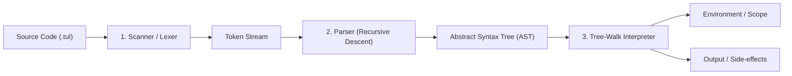
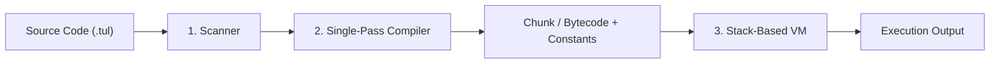

# TUL-X Architecture & Pipeline

TUL-X is an interpreter for the TUL-X programming language, designed and implemented in C following the architectural principles of Robert Nystrom's *Crafting Interpreters*.

---

## 1. High-Level Interpreter Pipeline

The journey from source code characters to evaluated runtime results passes through distinct stages:



Later in the project, the optimization roadmap transitions to a Bytecode Virtual Machine:



---

## 2. Core Components

### 1. Lexical Scanner (`src/scanner.c`, `src/token.c`, `src/keywords.c`)
* **Role**: Consumes the raw UTF-8 string source code character by character.
* **Output**: A flat array/stream of `Token` structures.
* **Key Concept**: Converts meaningful character groups into atomic units (**tokens**) tagged with token types (e.g., `TOKEN_VAR`, `TOKEN_IDENTIFIER`, `TOKEN_PLUS`, `TOKEN_NUMBER`), source locations (for debugging and error reporting), and string/number literals.

### 2. Abstract Syntax Tree (`src/expr.c`, `src/expr.h`, `src/ast_printer.c`)
* **Role**: Represents the nested grammatical structure of the program hierarchically in memory.
* **Design Pattern**: Implemented in C using **Tagged Unions** (`enum ExprType` + `union { ... }`) combined with a **Visitor Pattern** function-pointer table (`ExprVisitor`) to emulate object-oriented polymorphism without memory bloat.

### 3. Parser (`src/parser.c`)
* **Role**: Implements a **Recursive Descent Parser** that transforms a stream of tokens into an AST based on formal Context-Free Grammar (CFG) rules with precedence and associativity handling.

### 4. Runtime Evaluator & Environment (`src/interpreter.c`, `src/environment.c`)
* **Role**: Traverses the AST nodes, performs dynamic type checking, manages lexical scope bindings, and evaluates expressions/statements.

---

## 3. Directory Structure

```text
tul-x/
├── Makefile                # Build automation (standard, debug/ASan, test)
├── README.md               # Project overview, quickstart & roadmap
├── LICENSE                 # MIT License
├── .gitignore              # Ignored build binaries and OS artifacts
├── docs/                   # Documentation & Interview preparation
│   ├── architecture.md     # Pipeline architecture and execution diagrams
│   ├── language-spec.md    # Grammar and syntax specifications
│   └── interview-notes.md  # Core computer science & interview cheat-sheet
├── src/                    # C source files and headers
│   ├── common.h            # Standard macros, bools, error codes
│   ├── error.h             # Error reporting utilities
│   ├── main.c              # CLI runner and interactive REPL
│   ├── tokentype.h         # Enumeration of token categories
│   ├── token.h / .c        # Token struct representation and printing
│   ├── scanner.h / .c      # Lexical analyzer
│   ├── keywords.h / .c     # Reserved keyword table / Trie matcher
│   ├── expr.h / .c         # AST node definitions and constructors
│   ├── ast_printer.c       # AST pretty-printer (S-expression visualizer)
│   └── interpreter.c       # AST tree-walk evaluation engine
├── examples/               # Example TUL-X scripts (.tul)
│   └── hello.tul
└── tests/                  # Automated unit and integration test suite
    └── run_tests.sh
```
